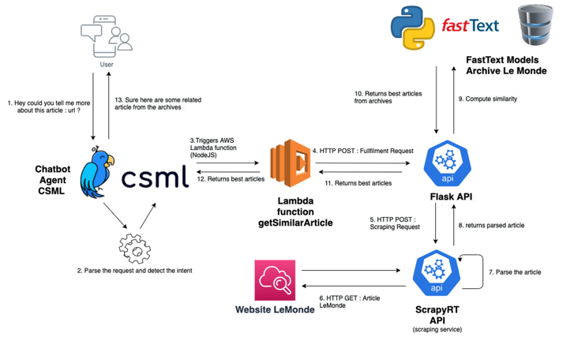

# Chatbot Newspaper

## Purpose of the project


This project was created to provide a use case for the models trained on this repo: [NewsBacklight](https://github.com/ldelille/NewsBacklight).

The chatbot was developed using [CSML](https://www.csml.dev/) which provides a declarative langage and a conversational engine. 
The _CSML_ platform provides also easy ways to deploy the conversational agent as well possibility to add _AWS Lambda_ function for recover
additional source of information (webhooks)

We assume the user is reading an article from a French newspaper. As he's reading the article, he might be interested in knowing if similar
events happened in the past.

* He asks the chatbot for similar article
* The agent trigger a lambda which sends a http call to an API
* The API recovers the article URL, launch a scraping process to recover the content of the article
* Python preprocessing scripts and similarity computing is launched
* Most similar articles from the archives are returned to the user


## Architecture




The lambda function is located in `webhook_service/webhook_csml/lambda_csml`. The code is manually added on th CSML platform.
 
I use ngrok [ngrok](https://ngrok.com/) in the code of the lambda function to create a http tunnel to my local machine. 

The two flask API runs locally. Endpoints are located in  `webhook_service/webhook_csml/index.py`. To run the base API on port 3000:

```bash
flask run -h localhost -p 3000
```

in `webhook_service/webhook_csml`

This codes triggers the live scraping of the article.
Adding HTTP server in front of a spider is not easy, I use [Scrapyrt](https://github.com/scrapinghub/scrapyrt) which launch an HTTP server which provides API for scheduling Scrapy spiders.
To get this server live just lauch : 

```bash
scrapyrt
```
in `scraping_news/scraping_services`


Then the preprocessing and the similarity computing is triggered : `webhook_service/webhook_csml/reco_single.py`.

Files containing the models trained in [NewsBacklight](https://github.com/ldelille/NewsBacklight), are loaded during the server launch. 

Finally the result is returned to the user ad a JSON file containing data from the archives